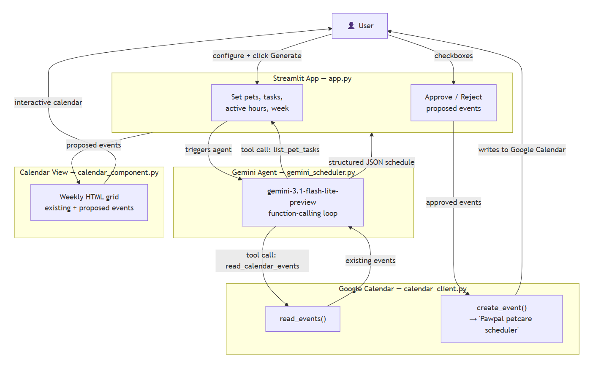
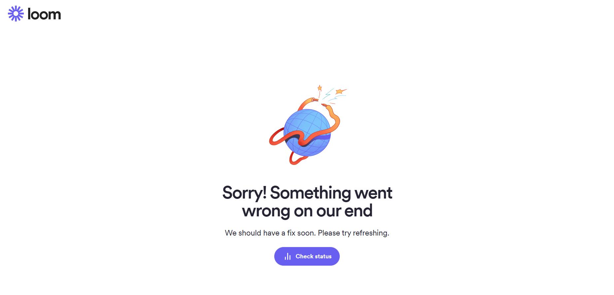

# PawPal+ Calendar Agent

---

## Original Project

**Base project:** PawPal+ (CodePath AI110, Module 3)

PawPal+ is a Streamlit daily pet care task planner. It lets owners register pets, assign care tasks with priorities and frequencies, and view a daily schedule with conflict detection and completion tracking. The original system handled task sorting, filtering, and local state — no external APIs or AI.

---

## What This Extension Adds

PawPal+ Calendar Agent extends the base project with:

- **Google Calendar integration** — reads your existing events via OAuth2 so the AI knows what time is already taken
- **`gemini-3.1-flash-lite-preview` scheduling agent** — uses function-calling to gather calendar data and pet tasks, then proposes a conflict-free weekly schedule
- **Interactive weekly calendar view** — proposed events appear highlighted alongside existing events; click any task to jump to its approval checkbox
- **Human-in-the-loop confirmation** — every AI-proposed event must be explicitly approved before it touches your calendar
- **Dedicated calendar** — all pet care events are written to a separate "Pawpal petcare scheduler" calendar for easy bulk deletion

---

## System Architecture



### Data flow summary

```
User configures or imports pets/tasks/active hours
    → clicks "Generate Schedule"
    → GeminiScheduler (gemini-3.1-flash-lite-preview)
        ├─ tool call: read_calendar_events → Google Calendar API
        └─ tool call: list_pet_tasks → in-memory pet/task data
    → returns proposed_events + unschedulable + reasoning_summary
    → calendar_component.py renders a mockup weekly calendar with existing + proposed events
    → user approves/rejects individual events
    → If the user chooses to add proposed events to their Google Calendar, calendar_client.py writes approved events to the "Pawpal petcare scheduler" calendar in their account
```

---

## Setup

### Prerequisites

- Python 3.11+
- A Google account
- Gemini API key — free at [aistudio.google.com](https://aistudio.google.com)

### Google Cloud setup (~5 minutes, one-time)

1. Go to [console.cloud.google.com](https://console.cloud.google.com)
2. Create a project → **APIs & Services → Enable APIs** → enable **Google Calendar API**
3. **Credentials → Create Credentials → OAuth Client ID → Desktop app**
4. Copy the **Client ID** and **Client Secret**
5. Add your Google account as a test user of the project: **OAuth consent screen → Test users → Add Users**

### Install and run

```bash
pip install -r requirements.txt
```

Create a `.env` file in the project root:

```
GOOGLE_CLIENT_ID=your_client_id.apps.googleusercontent.com
GOOGLE_CLIENT_SECRET=your_client_secret
GEMINI_API_KEY=your_gemini_key
```

```bash
streamlit run app.py
```

On first run, click **Connect Google Calendar** in the sidebar — a browser tab opens for Google sign-in. After approval, `token.json` is saved and future runs skip auth.

---

## Design Decisions

| Decision | Rationale | Trade-off |
|---|---|---|
| Gemini has read-only tools | Python owns all calendar writes — eliminates AI write errors | Agent can't self-correct if it proposes a bad time; user must reject and reschedule |
| Daily tasks never carry over | A missed daily walk is only unschedulable for that day — prevents doubled-up tasks | User must re-run for the next week; no auto-rollover |
| Separate "Pawpal petcare scheduler" calendar | User can delete all AI-added events in one step | Events appear in a separate calendar, not the user's primary one |
| Timezone from Google Calendar API | Detects user's actual timezone at runtime instead of hardcoding | Requires an extra API call on first use; cached via `lru_cache` |
| `st.components.v1.html()` for calendar | Avoids a full React component rewrite while giving a visual weekly grid | One-way rendering — direct in-calendar editing requires `window.parent` JS hacks |

---

## Testing Summary

### Unit tests — `pytest tests/`

32 tests across 6 files covering the full system without any real API calls:

| File | What it tests |
|---|---|
| `tests/test_pawpal.py` | Task completion, recurrence, scheduling, filtering, conflict detection |
| `tests/test_calendar_auth.py` | Auth state checks, token refresh, credential revocation |
| `tests/test_calendar_client.py` | Event parsing, all-day event handling, create event timing |
| `tests/test_data_io.py` | Export/import roundtrip, task fields, multi-pet, completed flag, active hours |
| `tests/test_gemini_scheduler.py` | Tool-call loop, step logging, reschedule flow, unknown tool error |
| `tests/test_calendar_component.py` | HTML output, day headers, active hours filtering, unschedulable list |

```bash
pytest tests/ -v
```

### Scheduling rule harness — `eval/test_harness.py`

5 functions that check whether a schedule object complies with the scheduling rules. The harness runs entirely against a hardcoded `MOCK_SCHEDULE` that was manually written to satisfy every rule — no model calls involved.

```
[PASS] Daily tasks not carried over to wrong day
[PASS] No task appears in both proposed and unschedulable
[PASS] All events within active hours
[PASS] No proposed event overlaps existing calendar events
[PASS] All unschedulable tasks have a reason
```

```bash
python eval/test_harness.py
# 5/5 tests passed
```

The 5/5 result means the validation functions themselves are correct. Because the mock data was crafted to comply, passing was guaranteed — this does not reflect model behavior. To evaluate actual model compliance, the harness would need to run against live Gemini output rather than static mock data.

---

## Responsible AI

**Limitations and biases**

- Active hours are a single daily window — weekday vs. weekend differences are not modeled
- The system has no concept of task dependencies (e.g., "vet visit before medication")
- Relies entirely on what's in Google Calendar; events in other calendars or outside the query window are invisible to the AI
- The model may prioritize earlier time slots, creating an implicit "morning bias" regardless of the owner's actual routine

**Potential misuse**

The main risk is credential exposure: if `token.json` or the `.env` file is shared or committed, a third party could read the user's full calendar. Mitigations: both files are in `.gitignore`; the model only has read-only tools and cannot write, delete, or share calendar data on its own.

**Testing surprises**

The most surprising finding was a 3-hour timezone offset — events intended for 7am appeared at 10am in Google Calendar. The root cause was a hardcoded Pacific timezone while the test account was in Eastern time. Fixing it required detecting the calendar's timezone at runtime rather than assuming one. This reinforced that AI systems interacting with real infrastructure need timezone-aware data handling, not just correct logic.

---

## AI Collaboration Reflection

**Helpful suggestion:** Claude (Claude Code) identified that `_calendar_reader` and `_task_lister` closures were defined inside the Streamlit button block. On reruns triggered by the "Reschedule Rejected" button, that block doesn't re-execute, so the closures would be out of scope and cause a `NameError`. Moving them outside the button block was a non-obvious Streamlit-specific fix that would have been hard to debug at runtime.

**Flawed suggestion:** Claude recommended switching from the `google-generativeai` SDK to `google-genai` and provided the full updated API surface. However, the `GenerateContentConfig` structure it wrote placed `system_instruction` in a position that conflicted with how the SDK validates config in certain versions, causing a validation error on first run. The fix required manually reading the SDK source to identify the correct field placement.

---

## Reflection

Building this project made clear that the hardest part of agentic AI is not the model — it's all the infrastructure the model sits on top of. OAuth flows, timezone handling, Streamlit's rerun model, and Google Calendar API quirks required more debugging time than the Gemini prompt itself.

The human-in-the-loop design felt genuinely important in practice. Several times during testing, Gemini proposed schedules that looked plausible but had subtle issues — events at the edge of active hours, or weekly tasks placed on the one day the owner was busiest. Having explicit approve/reject controls meant those issues were caught before hitting the real calendar. That experience shifted my view on what "AI-assisted" means: the value isn't automation, it's the combination of AI speed with human judgment at the decision point.

---

## File Structure

| File | Purpose |
|---|---|
| `app.py` | Main Streamlit app |
| `gemini_scheduler.py` | Gemini function-calling agent |
| `calendar_auth.py` | Google OAuth2 flow |
| `calendar_client.py` | Read/write Google Calendar events |
| `calendar_component.py` | Weekly HTML calendar renderer |
| `data_io.py` | Import/export pets & tasks as JSON |
| `pawpal_system.py` | Core domain model (original project) |
| `eval/test_harness.py` | Scheduling rule validation functions (static mock data) |
| `tests/test_pawpal.py` | Unit tests for core domain model |
| `tests/test_calendar_auth.py` | Unit tests for OAuth flow |
| `tests/test_calendar_client.py` | Unit tests for Calendar API wrapper |
| `tests/test_data_io.py` | Unit tests for import/export |
| `tests/test_gemini_scheduler.py` | Unit tests for Gemini agent |
| `tests/test_calendar_component.py` | Unit tests for HTML calendar renderer |
| `assets/architecture.mmd` | Mermaid source for system diagram |

--- 

## Demo walkthrough video: 

I keep getting error when trying sign up and download Loom:


### So please see my demo at [this Google Drive link](https://drive.google.com/drive/folders/1xKLDJ0WSyr29Rc-ShQINi0qQYJd2rO1t?usp=sharing) instead.

---

## Stretch Features

### Agentic Workflow Enhancement (+2pts)

The scheduling agent implements a multi-step tool-calling loop with observable intermediate steps:

- **Two tools, model-chosen order** — `list_pet_tasks` and `read_calendar_events` are available, but the model decides which to call and when. It consistently calls `list_pet_tasks` first to learn the week range, then uses those dates to call `read_calendar_events` — an emergent sequencing not explicitly required by the prompt.
- **Decision-making chain** — after both tool calls, the model reasons over the combined data to produce `proposed_events`, `unschedulable` (with per-task reasons), and a `reasoning_summary`.
- **Observable intermediate steps** — every tool call (name, arguments, result count) is logged in `GeminiScheduler.steps` and displayed in the "Gemini's tool call steps" expander in the UI.
- **Reject-and-retry loop** — when the user rejects proposed events, the agent reruns the full tool-call loop with confirmed events passed as blocked slots, producing new proposals only for the rejected tasks.

### Test Harness and Evaluation Script (+2pts)

Two layers of automated testing cover the system:

**`pytest tests/`** — 32 unit tests across 6 files covering every module in the system (domain model, OAuth flow, Calendar API wrapper, import/export, Gemini agent, HTML renderer):

**`eval/test_harness.py`** — a standalone evaluation script that runs 5 scheduling rule checks and prints a pass/fail summary.

